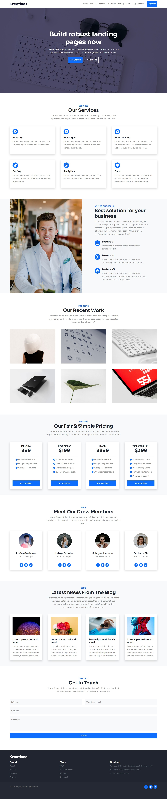

# Kreatives Landing Page featuring Bootstrap 5

This is my solution to the [Kreatives landing page](https://kreative-landing.netlify.app/) using Bootstrap 5.

## Table of contents

- [Overview](#overview)
  - [The challenge](#the-challenge)
  - [Screenshot](#screenshot)
  - [Live site](#live-site)
- [My process](#my-process)
  - [Built with](#built-with)
  - [Continued development](#continued-development)
  - [Useful resources](#useful-resources)
  - [Comments](#comments)
- [Acknowledgment](#acknowledgments)

## Overview

### The challenge

Users should be able to:

- View the optimal layout depending on their device's screen size
- See hover, active, and focus states for interactive elements on the page
- Receive error messages when the form is submitted if:
  - Any input field is empty

### Screenshot

#### Mobile

|                                               Initial state p.1                                               |                                                       Inital state p.2                                                        |                                                          Active states p.1                                                           | Active states p.2                                                                                                          |
| :-----------------------------------------------------------------------------------------------------------: | :---------------------------------------------------------------------------------------------------------------------------: | :----------------------------------------------------------------------------------------------------------------------------------: | -------------------------------------------------------------------------------------------------------------------------- |
|  |  |  |  |

#### Desktop

| Initial state |
| :-----------: |



### Live site

- [Live Site URL](https://jvmdo.github.io/framework-frontend-practice/bootstrap-kreative-landing-page/)

## My process

### Built with

- Mobile-first workflow
- Semantic HTML5 markup
- Bootstrap 5
- CSS3

### What I learned

- How to use Bootstrap layout, utilities and few components in a project.

### Comments

- Bootstrap multi-row-columns layout can be accomplished using to different approaches:

  ```html
  <!-- First -->
  <div class="row row-cols-1 row-cols-sm-2 row-cols-lg-3">
    <div class="col">content</div>
    <div class="col">content</div>
    <div class="col">content</div>
  </div>

  <!-- Second -->
  <div class="row">
    <div class="col-12 col-sm-6 col-lg-4">content</div>
    <div class="col-12 col-sm-6 col-lg-4">content</div>
    <div class="col-12 col-sm-6 col-lg-4">content</div>
  </div>
  ```

  In order to make all these columns same height tall, `height: 100%` must be applied in the `content`'s wrapper, not in the `col`.

- It is not a good idea to use the same `div.col` for `div.wrapper` purposes because of the earlier has some builtin spacing configuration. Do this instead:

  ```css
  <div class="col">
    <div class="wrapper">
      content
    </div>
  </div>
  ```

- The best way I know of to implement the overlay effect seen in the `projects` section is by writing:

  ```css
  .projects-image {
    transition: var(--transition);
  }

  .projects-image img {
    mix-blend-mode: overlay;
  }

  .projects-image:hover {
    background-color: var(--overlay);
  }
  ```

  But unfortunately there is a Firefox bug<sup>1</sup> that completely hides the image, showing it only when it is hovered. So, I had to implement it using `pseudo-elements`. The result is exactly the same effect. <small><sup>1</sup> I tried some workaround but they didn't work.</small>

- I made the pricing cards `display: grid` aiming to use `align-self` in order to put the buttons at the bottom. However, the grid don't match its parent's full height. Due to it, the alignment does nothing.

## Acknowledgments

- Thanks to SA7MAN for providing [the page design](<(https://kreative-landing.netlify.app/)>) and sharing [his tutorial on YouTube](https://www.youtube.com/channel/UCYMEEnLzGGGIpQQ3Nu_sBsQ).
