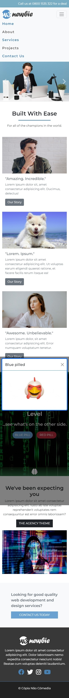
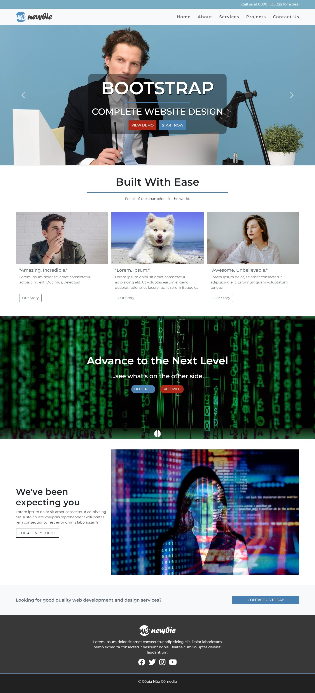

# Kreatives Landing Page featuring Bootstrap 5

This is my solution to one of the free [W3 Newbies challenges](https://w3newbie.com/template-bundle/) using Bootstrap 5.

## Table of contents

- [Overview](#overview)
  - [The challenge](#the-challenge)
  - [Screenshot](#screenshot)
  - [Live site](#live-site)
- [My process](#my-process)
  - [Built with](#built-with)
  - [Continued development](#continued-development)
  - [Useful resources](#useful-resources)
  - [Comments](#comments)
- [Acknowledgment](#acknowledgments)

## Overview

### The challenge

Users should be able to:

- View the optimal layout depending on their device's screen size
- See hover, active, and focus states for interactive elements on the page
- Use Bootstrap 5

### Screenshot

#### Mobile

| Initial state | Active states |
| :-----------: | :-----------: |
|  |  |

#### Desktop

| Initial state |
| :-----------: |


### Live site

- [Live Site URL](https://jvmdo.github.io/framework-frontend-practice/bootstrap-w3-newbies-page/)

## My process

### Built with

- Mobile-first workflow
- Semantic HTML5 markup
- Bootstrap 5
- CSS3

### What I learned

- How to use Bootstrap layout, utilities and few components in a project.

- `row` is flexbox-based, what does it means? We can apply flexbox properties using Bootstrap's classes.

  ```html
  <div class="row align-items-center justify-content-center"></div>
  ```

- It is nice increase/decrease the amount of columns an element gets for each breakpoint:
  ```html
  <div class="col-sm-6 col-md-8 col-lg-10"></div>
  <div class="col-sm-6 col-md-4 col-lg-2"></div>
  ```

## Acknowledgments

- Thanks to Drew Ryan from W3 Newbies for providing [the page design](https://w3newbie.com/template-bundle/) and sharing [his tutorial on YouTube](https://youtu.be/TJF4ldO91n4).
