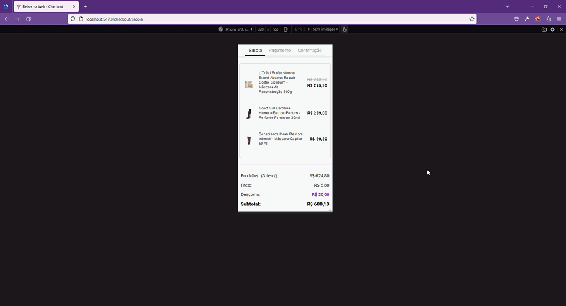

# Front-end Challenges - Beleza na Web

Projeto encontrado no [repositório Front-end Challenges](https://github.com/felipefialho/frontend-challenges), que contém uma lista acurada de desafios reais aplicados por companhias do mundo inteiro.

O [teste de frontend Beleza na Web](https://github.com/belezanaweb/test-front) exige que o desenvolvedor implemente um processo de *checkout* de 3 passos.

## Table of contents

- [Overview](#overview)
  - [The challenge](#the-challenge)
  - [Screenshot](#screenshot)
  - [Links](#links)
- [My process](#my-process)
  - [Built with](#built-with)
  - [What I learned](#what-i-learned)
  - [Questions](#questions)
  - [Continued development](#continued-development)
  - [Useful resources](#useful-resources)
- [Author](#author)

## Overview

O projeto consiste em um *checkout* de 3 passos nos quais o usuário pode revisar os itens do carrinho, preencher os detalhes de pagamento em um formulário formatado e validado e visualizar a confirmação da compra. Os dados da compra são recuperados de um *endpoint* fornecido pelos recrutadores na descrição do desafio.

Esse projeto é construído usando React, React Router and Styled Components.

### The challenge

Os recrutadores exigem:

1. *Pixel perfection*
2. Responsividade com abordagem *mobile-first*. O candidato é responsável por projetar o *layout* da versão *desktop*, pois apenas a versão *mobile* é fornecida no Figma
3. Os itens do carrinho devem ser recuperados do *endpoint* fornecido
4. Os campos do formulário devem ser devidamente formatados e validados
5. A finalização da compra deve ser habilitada somente se o formulário for válido

### Screenshot

(Actually, screencast)



### Links

- [Live preview](https://belezanaweb-checkout-jvmdo.netlify.app/)

- [Remote repository](https://github.com/jvmdo/framework-frontend-practice/tree/master/react-belezanaweb-checkout)

## My process

Iniciei o projeto configurando as rotas, incluindo métodos de `loader` e `action` às rotas que exigem tais funcionalidades. Assim, pude confirmar que a abordagem da Data API funciona para o propósito do projeto.

Em seguida, adicionei a formatação e validação dos campos de texto. Após isso, implementei a funcionalidade da barra de navegação superior.

Por fim, adicionei *layout* e estilos às páginas e componentes, finalizando com as questões de responsividade das telas.

### Built with

- Vite
- Semantic HTML5 markup
- Mobile-first workflow
- Flexbox / Grid
- TypeScript
- React.js
- React Router DOM
- React Hook Form
- Cleave.js
- Zod
- Validator.js
- Styled Components

### What I learned

**O principal motivo por eu ter escolhido esse desafio foi para praticar React Router v6.4 e sua nova Data API.**

- A maneira segura de se trabalhar com os dados de pagamento é realizar um POST dos dados na tela de pagamento e um GET na página de sucesso. Porém, sem *endpoints* pra isso, eu decidi passar os dados pela navegação para fins didáticos, pois sei que é inseguro.

  - Se houvesse os *endpoints*, eu passaria o ID retornado pelo POST para a página de sucesso via URL *params*, o qual seria recuperado no `loader` para fazer o GET.

- Mais prática com React Router e como fazer uso dos recursos da sua Data API

- Mais prática com React Hook Form

  - Manter estado do formulário usando seu `FormContext`

- Como utilizar Cleave.js com React.js

  - Instalar seus `@types`
  - Passar explicitamente `ref` do `<Controller>`

- Mais prática com Zod e sua integração com React Hook Form

- Como utilizar Validator.js com Zod *refinements*

  - Deve-se instalar seus `@types`

- Primeiro contado com React Portals

### Questions

1. How to make validator.isDate() work for 'MM/YY' format? I tried set different format but it did not work!

- I just can't make input's `:invalid` works. I had to added `.invalid` class when there is an error in the field.

  I tried: `setError`, `shouldUseNativeValidation`, ConstraintValidation API (it worked but react-hook-form has no idea of it). Also tried to select the input that is followed by `.error-message` using `:has()`.

  ```tsx
  function onFailSubmit(errors: FieldErrors<FormDataType>) {
    console.log(errors)
    // ? Why is setError not firing :invalid 😡
    // ? Why is [shouldUseNativeValidation] crashing the app
    Object.entries(errors)
      .map(([name, error]) => ({
        name: name as keyof FormDataType,
        type: error?.type as string,
        message: error?.message,
      }))
      .forEach(({ name, type, message }) => {
        setError(name, { type, message })
      })
  }
  ```

### Continued development

Uma melhoria pode ser feita na página de pagamento. Após POST dos dados, liberar a rota para a página de sucesso somente se o pagamento foi concluído. Porém, isso depende de um *backend*.

Outra melhoria seria aplicar `defer`, `Suspense` e ou `Await` da Data API para tratar adequadamente o carregamento da página para casos que as requisições demorem para retornar respostas.

### Useful resources

- [How to correctly type Data API methods](<https://github.com/remix-run/react-router/discussions/9792>) - Pelo que percebi, a tipagem da biblioteca é porca. Essa discussão me ajudou em resolver um dos problemas de tipagem que tive.

## Author

- GitHub - [jvmdo](https://github.com/jvmdo)

- Frontend Mentor - [@jvmdo](https://www.frontendmentor.io/profile/jvmdo)

- CodeWars - [jvmdo](https://www.codewars.com/users/jvmdo)

- LinkedIn - [João Oliveira](https://www.linkedin.com/in/de-oliveira-joao/)

## Números de cartões válidos para teste

Visa: 4111 1111 1111 1111

Mastercard: 5555 5555 5555 4444

American Express: 3782 8224 6310 005

Discover: 6011 1111 1111 1117

JCB: 3530 1113 3330 0000

Diners Club: 3056 9309 0259 04

UnionPay: 6221 8831 0000 0000 000

Maestro: 6759 6498 2643 8453

Mir: 2201 2201 2201 2201

Elo: 6363 1811 1111 1110
